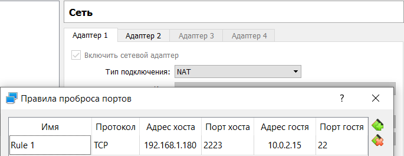
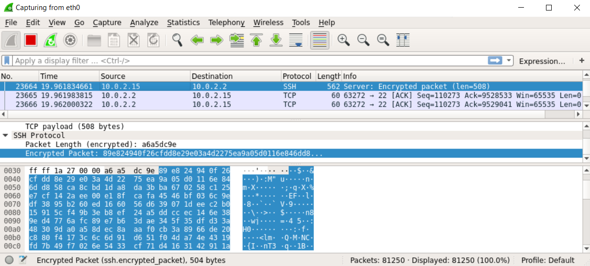

# Chapter References: #
* [Task 1](#task-1)
    1. [Part 1](#task-1-part-1)
    2. [Part 2](#task-1-part-2)
* [Task 2](#task-2)
* [Task 3](#task-3)
    1. [Part 1](#task-3-part-1)
    2. [Part 2](#task-3-part-2)
* [Task Networking](#task-networking)

## **Task 1** #
### Task 1 Part 1 #
1. Log in to the system as root.
    ```
    login as: student
    student@192.168.1.103's password: (1Q2w3E)
    ```
2. Use the passwd command.
    
    ```
    student@CsnKhai:~$ passwd
    Changing password for student.
    (current) UNIX password:
    Enter new UNIX password:
    Retype new UNIX password:
    ```
    
    **basic commands:**
    -a, --all
        This option can be used only with -S and causes show status for all users.

    -d, --delete
        Delete a user's password (make it empty). This is a quick way to
        disable a password for an account. It will set the named account
        passwordless.
        
    -l, --lock
        Users with a locked password are not allowed to change their
        password.
    
    **files:**
    /etc/passwd - contain info about users
    /etc/shadow - contain info about passwords and params
    
3. Determine the users registered in the system.
    Registered users by their directories:
    ```
    student@CsnKhai:~$ w
    21:38:45 up  2:19,  3 users,  load average: 0.00, 0.01, 0.04
    USER     TTY      FROM             LOGIN@   IDLE   JCPU   PCPU WHAT
    student  tty1                      19:19    2:18m  0.07s  0.06s -bash
    student  pts/0    192.168.1.102    19:20    3.00s  0.55s  0.00s w
    student  pts/1    192.168.1.102    20:57   38:40   0.11s  0.11s -bash
    ```
    It displayed for each user: login name, the tty name, the remote host, login time, idle time, JCPU, PCPU, and the command line of their current process.

4. Change self info.
    Change home phone number and office room
    ```
    student@CsnKhai:~$ chfn -h 88005553535
    Password:
    student@CsnKhai:~$ chfn -r 144
    Password:
    ```
    
5. Become familiar with the Linux help system.
    Find command by keyword:
    ```
    student@CsnKhai:~$ man -k append
    ssh-import-id (1)    - retrieve one or more public keys from a public keyserv...
    ssh-import-id-gh (1) - retrieve one or more public keys from a public keyserv...
    ssh-import-id-lp (1) - retrieve one or more public keys from a public keyserv...
    ```
    Preview of command:
    ```
    student@CsnKhai:~$ man -f man
    man (1)              - an interface to the on-line reference manuals
    man (7)              - macros to format man pages

    ```

6. Explore the more and less commands.
    The `more` command open file in console with opportunity to slide it down/
    The `less` command open file in text reader and don't scripe something to console

7. Add plan for user
    For plan, you need to create .plan in user directory:
    ```
    student@CsnKhai:~$ finger student
    Login: student                          Name: Student KhAI
    Directory: /home/student                Shell: /bin/bash
    Office: 144                             Home Phone: +8-800-555-3535
    On since Tue Aug  3 19:19 (UTC) on tty1    3 hours 11 minutes idle
         (messages off)
    On since Tue Aug  3 19:20 (UTC) on pts/0 from 192.168.1.102
       5 seconds idle
    On since Tue Aug  3 20:57 (UTC) on pts/1 from 192.168.1.102
       14 minutes 52 seconds idle
    No mail.
    No Plan.
    student@CsnKhai:~$ echo "Work hard on LR1" > .plan
    student@CsnKhai:~$ finger student
    Login: student                          Name: Student KhAI
    Directory: /home/student                Shell: /bin/bash
    Office: 144                             Home Phone: +8-800-555-3535
    On since Tue Aug  3 19:19 (UTC) on tty1    3 hours 13 minutes idle
         (messages off)
    On since Tue Aug  3 19:20 (UTC) on pts/0 from 192.168.1.102
       5 seconds idle
    On since Tue Aug  3 20:57 (UTC) on pts/1 from 192.168.1.102
       17 minutes 43 seconds idle
    No mail.
    Plan:
    Work hard on LR1
    ```
    
8. Show what in home directory:
    With recursive:
    ```
    student@CsnKhai:~$ ls -R
    .:
    test  Work
    
    ./test:
    
    ./Work:
    Course
    
    ./Work/Course:
    Linux Base
    
    ./Work/Course/Linux Base:
    Task1
    
    ./Work/Course/Linux Base/Task1:
    readme.md  tasks.sh
    ```

### Task 1 Part 2 #
1. Log in to the system as root.
    Show all files that starts with 'c' or contain 'sk' in name.
    ```
    student@CsnKhai:~$ tree -P 'c*|*sk*'
    .
    ├── test
    └── Work
        └── Course
            └── Linux Base
                └── Task1
                    ├── task1part1.sh
                    └── task1part2.sh
    
    5 directories, 2 files
    ```
    List subdirectories of the root directory up to and including the second nesting level.
    ```
    student@CsnKhai:~$ tree -P 'c*|*sk*' -L 2
    .
    ├── test
    └── Work
        └── Course
    
    3 directories, 0 files
    ```
    
2. Determine the type of file.
    ```
    student@CsnKhai:~/Work/Course/Linux Base$ file readme.md
    readme.md: UTF-8 Unicode text, with CRLF line terminators
    ```
    
3. Navigation.
    `cd` - command for navigation. 
    `cd /` - navigate to root (absolute).
    `cd ~` - navigate to home.
    `cd ..` - navigate to previous derictory.
    
    ```
    student@CsnKhai:~/Work/Course/Linux Base/Task1$ cd ~
    student@CsnKhai:~$ cd ../../etc/
    student@CsnKhai:/etc$ 
    ```
4. The ls command.
    Let's print all files and directories without ignore files starting with "." (-a),
    full info, but without group column (-o) (like -l, but without groups),
    with slash at the end of derictory (-p).
    ```
    student@CsnKhai:~$ ls -oap
    total 60
    drwxr-xr-x 6 student 4096 Aug  4 01:22 ./
    drwxr-xr-x 3 root    4096 Sep 15  2015 ../
    -rw------- 1 student  391 Aug  3 09:12 .bash_history
    -rw-r--r-- 1 student  220 Sep 15  2015 .bash_logout
    -rw-r--r-- 1 student 3637 Sep 15  2015 .bashrc
    drwx------ 2 student 4096 Sep 15  2015 .cache/
    -rw-rw-r-- 1 student   49 Aug  3 23:03 .gitconfig
    -rw-rw-r-- 1 student   17 Aug  3 22:33 .plan
    -rw-r--r-- 1 student  675 Sep 15  2015 .profile
    drwx------ 2 student 4096 Aug  2 14:41 .ssh/
    drwxrwxr-x 2 student 4096 Aug  2 12:55 test/
    -rw------- 1 student 5805 Aug  3 21:22 .viminfo
    drwxrwxr-x 3 student 4096 Aug  3 07:45 Work/
    -rw------- 1 student  212 Aug  4 01:22 .Xauthority
    ```
5. Sequence of operations.
    
    ```
    student@CsnKhai:~$ mkdir for_fifth_task
    student@CsnKhai:~$ ls -od /*/ > for_fifth_task/root_d_info.txt
    student@CsnKhai:~$ less for_fifth_task/root_d_info.txt
    student@CsnKhai:~$ cp for_fifth_task/root_d_info.txt relative_copy.txt
    student@CsnKhai:~$ cp ~/for_fifth_task/root_d_info.txt absolute_copy.txt
    student@CsnKhai:~$ ls -d *copy*
    absolute_copy.txt  relative_copy.txt
    student@CsnKhai:~$ rm -rf for_fifth_task
    student@CsnKhai:~$ ls
    absolute_copy.txt  relative_copy.txt  test  Work
    student@CsnKhai:~$ rm absolute_copy.txt relative_copy.txt
    student@CsnKhai:~$ ls
    test  Work
    ```
    
6. Sequence of operations. Links.
    
    - `student@CsnKhai:~$ mkdir test`
    - `student@CsnKhai:~$ cp .bash_history test/labwork2`
    - ```
      student@CsnKhai:~$ ln test/labwork2 test/hard_ln  
      student@CsnKhai:~$ ln -s test/labwork2 test/soft_ln
      ```
    - The differance: hard link - like second name, symbolic link - reference to file/directory  
      ```
      student@CsnKhai:~$ ls -od test/*ln
      -rw------- 2 student 399 Aug  4 02:56 test/hard_ln
      lrwxrwxrwx 1 student   8 Aug  4 02:55 test/soft_ln -> labwork2
      ```
    - Append file with word "changes" in new line by symbolic link to data file  
    `student@CsnKhai:~$ echo "changes" >> test/soft_ln`  
    - `student@CsnKhai:~$ mv test/hard_ln test/hard_lnk_labwork2`  
    - `student@CsnKhai:~$ mv test/soft_ln test/soft_lnk_labwork2`  
    - `student@CsnKhai:~$ rm -rf test`  
    After all (if links wasn't in test directory wich was deleted), hard link would works normally, but symbolic link reference to non-existing file.  
    
7. Using the locate utility.
    With command "locate" find files with "sqid" and "traceroute":
    ```
    student@CsnKhai:~$ locate sqid
    student@CsnKhai:~$ locate traceroute
    /etc/alternatives/traceroute6
    /etc/alternatives/traceroute6.8.gz
    /lib/modules/3.13.0-63-generic/kernel/drivers/tty/n_tracerouter.ko
    /usr/bin/traceroute6
    /usr/bin/traceroute6.iputils
    /usr/share/man/man8/traceroute6.8.gz
    /usr/share/man/man8/traceroute6.iputils.8.gz
    /var/lib/dpkg/alternatives/traceroute6
    ```

8. Determine partitions wich mounted in the system.

    ```
    student@CsnKhai:~$ findmnt
    TARGET                       SOURCE                            FSTYPE   OPTIONS
    /                            /dev/disk/by-uuid/ee9b6c41-7517-488b-829c-3075795a3 524
                                                                   ext4     rw,relat
    ├─/sys                       sysfs                             sysfs    rw,nosui
    │ ├─/sys/fs/cgroup                                             tmpfs    rw,relat
    │ │ └─/sys/fs/cgroup/systemd systemd                           cgroup   rw,nosui
    │ ├─/sys/fs/fuse/connections                                   fusectl  rw,relat
    │ ├─/sys/kernel/debug                                          debugfs  rw,relat
    │ ├─/sys/kernel/security                                       security rw,relat
    │ └─/sys/fs/pstore                                             pstore   rw,relat
    ├─/proc                      proc                              proc     rw,nosui
    ├─/dev                       udev                              devtmpfs rw,relat
    │ └─/dev/pts                 devpts                            devpts   rw,nosui
    └─/run                       tmpfs                             tmpfs    rw,nosui
      ├─/run/lock                                                  tmpfs    rw,nosui
      ├─/run/shm                                                   tmpfs    rw,nosui
      └─/run/user                                                  tmpfs    rw,nosui
    ```
9. Count the number of lines containing a given sequence of characters.
    For count lines with a given sequence of characters, use `grep` (for finding lines with matching sequence) and `wc -l` (for count lines).
    ```
    student@CsnKhai:~/Work/Course/Linux Base$ grep 'ch' Task1/task1part2.sh
    echo "1) you already login, isn't you?"
    echo "2) change password by `passwd` command"
    echo "3) check all users registered now"
    echo "4) change home phone number and office room"
    chfn -h 88005553535
    chfn -r 144
    echo "5) use couple of commands for help system"
    echo "(search by keyword `append`)"
    echo "(short description of command `man`)"
    echo "6) Explore the more and less commands using the help system. (I don't want to pollute your console, so nothing to execute)"
    echo "7) add plan for user"
    echo "Work hard on LR1" > .plan
    echo "8) show all user files"
    student@CsnKhai:~/Work/Course/Linux Base$ grep 'ch' Task1/task1part2.sh | wc -l  13
    ```

10. Find all files in the /etc directory containing the host character sequence.
    Use `find /etc/ -name "*host*"` for finding files with name \*host\*.
    ```
    student@CsnKhai:~/Work/Course/Linux Base$ sudo find /etc/ -name "*host*"
    /etc/hosts
    /etc/hosts.allow
    /etc/ssh/ssh_host_ed25519_key.pub
    /etc/ssh/ssh_host_ecdsa_key.pub
    /etc/ssh/ssh_host_rsa_key
    /etc/ssh/ssh_host_rsa_key.pub
    /etc/ssh/ssh_host_ecdsa_key
    /etc/ssh/ssh_host_dsa_key.pub
    /etc/ssh/ssh_host_dsa_key
    /etc/ssh/ssh_host_ed25519_key
    /etc/init/hostname.conf
    /etc/hostname
    /etc/hosts.deny
    /etc/host.conf
    /etc/dbus-1/system.d/org.freedesktop.hostname1.conf
    ```
    
11. List all objects in /etc that contain the ss character sequence.
    We take list of objects in `/etc/` and than search sequences '*ss*' by `grep` command.
    ```
    student@CsnKhai:~/Work/Course/Linux Base/Task1$ sudo ls /etc/ | grep "ss"
    insserv
    insserv.conf
    insserv.conf.d
    issue
    issue.net
    nsswitch.conf
    passwd
    passwd-
    ssh
    ssl
    upstart-xsessions
    ```
12. Screen-by-screen print of the contents of the /etc directory.
    Use pipe redirection `' | '`
    ```
    student@CsnKhai:~$ ls -l /etc/ | less
    ```
    
13. Determine the type of devices.
    Device type are denoted as the following:

    c - character *(transfer data, but one a character at a time)*
    b - block *(transfer data in large fixed-sized blocks)*
    p - pipe *(allow two or more processes to communicate with each other)*
    s - socket *(for communication between processes)*
    
    ```
    student@CsnKhai:~$ ls -l /dev/
    ...
    crw-------  1 student tty       4,   1 Aug  5 15:31 tty1
    ...
    brw-rw----  1 root    disk      8,   0 Aug  5 14:36 sda
    ...
    srw-rw-rw-  1 root    root           0 Aug  5 14:36 log
    ...
    ```
    
14. Determine the type of file in the system.
    by command `ls -l` we can see type-symbol as the first character of the file permission part.
    – : regular file
    d : directory
    c : character device file
    b : block device file
    s : local socket file
    p : named pipe
    l : symbolic link
    
15. First 5 directory files that were recently accessed in the **/etc** directory.
    The `ls -t` sort by modification time, ` | head -5` prints only five rows.
    ```
    student@CsnKhai:~$ ls -lt /etc/ | head -5
    total 732
    -rw-r--r-- 1 root root     733 Aug  5 14:36 mtab
    -rw-r--r-- 1 root root    1127 Aug  3 21:56 passwd
    -rw------- 1 root root    1124 Aug  3 21:55 passwd-
    drwxr-xr-x 2 root root    4096 Aug  3 21:07 pam.d
    ```

## **Task 2** #
1. The structure of the /etc/passwd and /etc/group.
    File `etc/passwd` contains lines of the following form, separated by colons:
    `username: pswd: uid: gid: uid comments: directory: shell`
    Where:
    **username** - username
    **pswd** - password
    **uid** - unique identifier of the user within the system
    **gid** - unique identifier of the group within the system to which the user belongs
    **uid comments** - comment, extended user description, for example, full name
    **directory** - user's home directory
    **shell** - program name - the user's command interpreter
    
    File `etc/group` contains lines of the following form, separated by colons:
    `group_name:password:group_id:list`
    Where:
    **group_name** - name for the group 
    **password** - encrypted password of this group
    **group_id** - unique identifier for this group
    **list** - a comma separated list of users belonging to this group
    
2. What are the uid.
    Unique identifier for the user.
    The range of uid not more than 65535. Some identifiers are reserved for special use.
    You can define self uid by `id` command, or see in `/etc/passwd`
    
3. What is gid.
    Unique identifier for this group.
    You can define your groups (where you take a part) by `id` command, or see in `/etc/passwd` gid of your group. Also, you can find all groups in `/etc/group`
    
4. Belonging of user to the specific group.
    You can define your groups (where you take a part) by `id` command
    ```
    student@CsnKhai:~$ id
    uid=1000(student) gid=1000(student) groups=1000(student),4(adm),24(cdrom),27(sudo),30(dip),46(plugdev),109(lpadmin),110(sambashare)
    ```
    
5. Adding a user to the system.
    There are two ways to create a user `adduser` (wich creating home directory) and `useradd` (without creating home directory). But `useradd -m` - creates home directory.
    ```
    student@CsnKhai:~$ sudo useradd -m petya
    [sudo] password for student:
    student@CsnKhai:~$ cat /etc/passwd | tail -2
    student:x:1000:1000:Student KhAI,144,,88005553535:/home/student:/bin/bash
    petya:x:1001:1001::/home/petya:
    student@CsnKhai:~$ ls /home/
    petya  student
    ```
    
6. Change the account name.
    `usermod -l NEW_LOGIN LOGIN` - changes LOGIN to NEW_LOGIN. But home derictories still have old name.
    ```
    student@CsnKhai:~$ sudo usermod -l petya9000 petya
    student@CsnKhai:~$ cat /etc/passwd | tail -2
    student:x:1000:1000:Student KhAI,144,,88005553535:/home/student:/bin/bash
    petya9000:x:1001:1001::/home/petya:
    student@CsnKhai:~$ ls /home/
    petya  student
    ```
    
7. What is skell_dir.
    The `skell_dir` is template for creating a new user home directory. By default `/etc/skel`. When we create a new user, we can specify skell_dir by `-k PATH`.
    ```
    student@CsnKhai:/etc$ sudo mkdir skel_custom
    [sudo] password for student:
    student@CsnKhai:/etc$ cd skel_custom/
    student@CsnKhai:/etc/skel_custom$ sudo touch greetings.txt
    student@CsnKhai:/etc/skel_custom$ sudo vim greetings.txt
    student@CsnKhai:/etc/skel_custom$ cd ~
    student@CsnKhai:~$ sudo useradd -m -k /etc/skel_custom vasya
    student@CsnKhai:~$ ls /home/vasya/
    greetings.txt
    student@CsnKhai:~$ cat /home/vasya/greetings.txt
    Hello, this is your home directory!
    ```
8. Remove a user from the system.
    
    ```
    student@CsnKhai:~$ sudo userdel -r petya9000
    [sudo] password for student:
    userdel: petya9000 mail spool (/var/mail/petya9000) not found
    student@CsnKhai:~$ cat /etc/passwd | tail -1
    student:x:1000:1000:Student KhAI,144,,88005553535:/home/student:/bin/bash
    ```
        
9. Lock and unlock a user account.
    Use `usermod -L` to lock the user password and `usermod -U` to unlock.
    ```
    student@CsnKhai:~$ sudo usermod -L vasya
    student@CsnKhai:~$ sudo grep vasya /etc/shadow
    vasya:!$6$JtRSG3tz$3pd5Dn1c7vuyRwYy7uq6Cvdgghm2U9Vdh4ci9DL4WYCvBfd0slGTl9GQjHqBv72f0JqvpPtg7rJfkBBCgVmck/:18844:0:99999:7:::
    student@CsnKhai:~$ sudo usermod -U vasya
    student@CsnKhai:~$ sudo grep vasya /etc/shadow
    vasya:$6$JtRSG3tz$3pd5Dn1c7vuyRwYy7uq6Cvdgghm2U9Vdh4ci9DL4WYCvBfd0slGTl9GQjHqBv72f0JqvpPtg7rJfkBBCgVmck/:18844:0:99999:7:::
    ```
        
10. Provide user with a password-free login.
    We need to delete password? by `passwd -d`.
    ```
    student@CsnKhai:~$ sudo passwd -d vasya
    passwd: password expiry information changed.
    student@CsnKhai:~$ sudo grep vasya /etc/shadow
    vasya::18844:0:99999:7:::
    ```
        
11. The extended format of information about the directory.
    Columns: File type | Permission access | Count of hardlinks | Owner | Group | Size | Last Modification | Name
    ```
    student@CsnKhai:~$ ls -la
    total 56
    drwxr-xr-x 5 student student 4096 Aug  5 19:22 .
    drwxr-xr-x 4 root    root    4096 Aug  5 18:33 ..
    -rw------- 1 student student 4096 Aug  5 18:56 .bash_history
    -rw-r--r-- 1 student student  220 Sep 15  2015 .bash_logout
    -rw-r--r-- 1 student student 3637 Sep 15  2015 .bashrc
    drwx------ 2 student student 4096 Sep 15  2015 .cache
    -rw-rw-r-- 1 student student   49 Aug  3 23:03 .gitconfig
    -rw-rw-r-- 1 student student   17 Aug  3 22:33 .plan
    -rw-r--r-- 1 student student  675 Sep 15  2015 .profile
    drwx------ 2 student student 4096 Aug  2 14:41 .ssh
    -rw------- 1 student student 5951 Aug  5 18:30 .viminfo
    drwxrwxr-x 3 student student 4096 Aug  3 07:45 Work
    -rw------- 1 student student  212 Aug  5 19:02 .Xauthority
    ```
        
12. What access rights exist and for whom.
    There are 9 symbols for 3 types of users (Owner, Group, Other). Every type have 3 symbols rwx (or ---), where:
    **r** - Permission for read the file.
    **w** - Permission for write the file.
    **x** - Permission for execute the file.

13. The sequence of defining the relationship between the file and the user.
    For changing access permission, use `chmod` than write type of user (u,g,o,a), what need to do with permission(+,-,=) and permission (r,w,x).
    ```
    student@CsnKhai:~$ cd /home/vasya/
    student@CsnKhai:/home/vasya$ ls -l
    total 4
    -rw-r--r-- 1 vasya vasya 36 Aug  5 18:30 greetings.txt
    student@CsnKhai:/home/vasya$ sudo chmod u+x greetings.txt
    [sudo] password for student:
    student@CsnKhai:/home/vasya$ ls -l
    total 4
    -rwxr--r-- 1 vasya vasya 36 Aug  5 18:30 greetings.txt
    ```
 
14. Commands to change the owner of a file.
    Use `chown`.
    ```
    student@CsnKhai:/home/vasya$ ls -l
    total 4
    -rwxr--r-- 1 vasya vasya 36 Aug  5 18:30 greetings.txt
    student@CsnKhai:/home/vasya$ sudo chown student greetings.txt
    student@CsnKhai:/home/vasya$ ls -l
    total 4
    -rwxr--r-- 1 student vasya 36 Aug  5 18:30 greetings.txt
    ```
 
15. Octal representation of access rights.
    For describe access permission in octal representation, we use sum of permission value to file for one type of user (r=4, w=2, x=1), for example `rwx=7`, `r-x=5`, `--x=1`. 
    Change permission to `rwxrwxr-x` (octal: 775):
    ```
    student@CsnKhai:/home/vasya$ ls -l
    total 4
    -rwxr--r-- 1 student vasya 36 Aug  5 18:30 greetings.txt
    student@CsnKhai:/home/vasya$ chmod 775 greetings.txt
    student@CsnKhai:/home/vasya$ ls -l
    total 4
    -rwxrwxr-x 1 student vasya 36 Aug  5 18:30 greetings.txt
    ```

16. Definitions of sticky bits and mechanism of identifier substitution.
    The sticky bits are used aspecially for derictories when we need save files from deleting by any other user (except superuser).
    
    ```
    student@CsnKhai:/$ mkdir ~/dont_delete_files
    student@CsnKhai:/$ cd ~/
    student@CsnKhai:~$ chmod 777 dont_delete_files/
    student@CsnKhai:~$ ls -l
    student@CsnKhai:~$ sudo chown vasya:vasya dont_delete_files
    student@CsnKhai:~$ sudo chmod 1777 dont_delete_files/
    student@CsnKhai:~$ ls -l
    total 8
    drwxrwxrwt 2 vasya   vasya   4096 Aug  5 20:06 dont_delete_files
    drwxrwxr-x 3 student student 4096 Aug  3 07:45 Work
    student@CsnKhai:~$ echo "I'm alive?" > dont_delete_files/save2.me
    student@CsnKhai:~$ sudo chown vasya:vasya dont_delete_files/save2.me
    student@CsnKhai:~$ ls -l dont_delete_files/
    total 4
    -rw-rw-r-- 1 vasya vasya 11 Aug  5 20:13 save2.me
    student@CsnKhai:~$ rm dont_delete_files/save2.me
    student@CsnKhai:~$ ls dont_delete_files/
    student@CsnKhai:~$ sudo chmod 0777 dont_delete_files/
    student@CsnKhai:~$ ls -l
    total 8
    drwxrwxrwx 2 vasya   vasya   4096 Aug  5 20:09 dont_delete_files
    drwxrwxr-x 3 student student 4096 Aug  3 07:45 Work 
    student@CsnKhai:~$ echo "I'm alive?" > dont_delete_files/save2.me
    student@CsnKhai:~$ sudo chown vasya:vasya dont_delete_files/save2.me
    student@CsnKhai:~$ ls -l dont_delete_files/
    total 4
    -rw-rw-r-- 1 vasya vasya 11 Aug  5 20:13 save2.me 
    student@CsnKhai:~$ rm dont_delete_files/save2.me
    rm: remove write-protected regular file ‘dont_delete_files/save2.me’? y
    rm: cannot remove ‘dont_delete_files/save2.me’: Operation not permitted
    ```
 
17. File attributes in the command script.
    There are 13 file attributes:
    a - append only: this attribute allows a file to be added to, but not to be removed. It prevents accidental or malicious changes to files that record data, such as log files.
    c - compressed: it causes the kernel to compress data written to the file automatically and uncompress it when it’s read back.
    d - no dump: it makes sure the file is not backed up in backups where the dump utility is used
    e - extent format: it indicates that the file is using extents for mapping the blocks on disk.
    i - immutable: it makes a file immutable, which goes a step beyond simply disabling write access to the file. The file can’t be deleted, links to it can’t be created, and the file can’t be renamed.
    j - data journaling: it ensures that on an Ext3 file system the file is first written to the journal and only after that to the data blocks on the hard disk.
    s - secure deletion: it makes sure that recovery of a file is not possible after it has been deleted.
    t - no tail-merging: Tail-merging is a process in which small data pieces at a file’s end that don’t fill a complete block are merged with similar pieces of data from other files.
    u - undeletable: When a file is deleted, its contents are saved which allows a utility to be developed that works with that information to salvage deleted files.
    A - no atime updates: Linux won’t update the access time stamp when you access a file.
    D - synchronous directory updates: it makes sure that changes to files are written to disk immediately, and not to cache first.
    S - synchronous updates: the changes on a file are written synchronously on the disk.
    T - and top of directory hierarchy: A directory will be deemed to be the top of directory hierarchies for the purposes of the Orlov block allocator.
 

## **Task 3** #
### Task 3 Part 1 #
1. How many states could has a process in Linux.
    1. Created
    2. Ready
    3. Running
    4. Waiting
    5. Terminated
    
2. The `pstree` command.
    The `pstree` command - display a tree of processes.
    ```
    student@CsnKhai:~$ pstree
    init─┬─cron
         ├─dbus-daemon
         ├─dhclient
         ├─5*[getty]
         ├─login───bash
         ├─rsyslogd───3*[{rsyslogd}]
         ├─sshd─┬─sshd───sshd───bash───pstree
         │      └─sshd───sshd───sftp-server
         ├─systemd-logind
         ├─systemd-udevd
         ├─upstart-file-br
         ├─upstart-socket-
         └─upstart-udev-br
     ```
3. Proc file system
    procfs - hierarchical representation of all processes, wich mount in `/proc`
    It have:
    **PID/** - info about processes.
    **cpuinfo/** - info about CPU.
    **devices/** - list of configured devices
    **mounts/** - mounted file systems.
    **sys/** - writable info about system.
    
4. Print information about the processor.
    ```
    student@CsnKhai:~$ cat /proc/cpuinfo
    processor       : 0
    vendor_id       : GenuineIntel
    cpu family      : 6
    model           : 158
    model name      : Intel(R) Core(TM) i5-7300HQ CPU @ 2.50GHz
    ...
    ```

5.Use the ps command to get information about the process.
    Use `-a` for watching all processes and `-u` for user format.
    ```
    student@CsnKhai:~$ ps -au
    USER       PID %CPU %MEM    VSZ   RSS TTY      STAT START   TIME COMMAND
    root       695  0.0  0.0   4644   840 tty4     Ss+  18:56   0:00 /sbin/getty -8 38400 tty
    root       697  0.0  0.0   4644   824 tty5     Ss+  18:56   0:00 /sbin/getty -8 38400 tty
    root       700  0.0  0.0   4644   832 tty2     Ss+  18:56   0:00 /sbin/getty -8 38400 tty
    root       701  0.0  0.0   4644   824 tty3     Ss+  18:56   0:00 /sbin/getty -8 38400 tty
    root       703  0.0  0.0   4644   828 tty6     Ss+  18:56   0:00 /sbin/getty -8 38400 tty
    root       796  0.0  0.1   4400  1976 tty1     Ss   18:56   0:00 /bin/login --
    vasya      837  0.0  0.2   6660  2852 tty1     S+   19:01   0:00 -bash
    student    884  0.0  0.3   6816  3296 pts/0    Ss   19:02   0:01 -bash
    student   1511  0.0  0.1   5216  1168 pts/0    R+   21:44   0:00 ps -au
    ```
6. How to define kernel processes and user processes?
    If `USER` equals `root`? than this is the kernal process, if equals to user name - this is user process.
    
7. Вescribe the statuses of the processes.
    - D	uninterruptible sleep (usually IO)
    - R	running or runnable (on run queue)
    - S	interruptible sleep (waiting for an event to complete)
    - T	stopped, either by a job control signal or because it is being traced
    - W	paging (not valid since the 2.6.xx kernel)
    - X	dead (should never be seen)
    - Z	defunct ("zombie") process, terminated but not reaped by its parent
    
8.  Display only the processes of a specific user.
    ```
    student@CsnKhai:~$ ps -a -fu student
    UID        PID  PPID  C STIME TTY          TIME CMD
    student    881   862  0 08:23 ?        00:00:00 sshd: student@pts/0
    student    882   881  0 08:23 pts/0    00:00:00 -bash
    student   1086  1065  0 10:47 ?        00:00:00 sshd: student@pts/1
    student   1104  1067  0 10:47 ?        00:00:00 sshd: student@notty
    student   1105  1104  0 10:47 ?        00:00:00 /usr/lib/openssh/sftp-server
    student   1106  1086  0 10:47 pts/1    00:00:00 -bash
    student   1224   882  0 18:57 pts/0    00:00:00 ps -a -fu student
    ```  
9. Analyze existing running tasks.
    By `ps` command:
    ```
    student@CsnKhai:~$ ps axu
    USER       PID %CPU %MEM    VSZ   RSS TTY      STAT START   TIME COMMAND
    root         1  0.0  0.2   4204  2204 ?        Ss   08:09   0:01 /sbin/init
    root         2  0.0  0.0      0     0 ?        S    08:09   0:00 [kthreadd]
    root         3  0.0  0.0      0     0 ?        S    08:09   0:00 [ksoftirqd/0]
    root         4  0.0  0.0      0     0 ?        S    08:09   0:00 [kworker/0:0]
    root         5  0.0  0.0      0     0 ?        S<   08:09   0:00 [kworker/0:0H]
    root         6  0.0  0.0      0     0 ?        S    08:09   0:00 [kworker/u2:0]
    root         7  0.0  0.0      0     0 ?        S    08:09   0:00 [rcu_sched]
    root         8  0.0  0.0      0     0 ?        S    08:09   0:00 [rcu_bh]
    ...
    ```
    By `top` command:
    ```
    top - 19:02:39 up 10:52,  2 users,  load average: 0.00, 0.01, 0.05
    Tasks:  68 total,   1 running,  67 sleeping,   0 stopped,   0 zombie
    %Cpu(s):  0.0 us,  0.0 sy,  0.0 ni, 99.7 id,  0.0 wa,  0.0 hi,  0.3 si,  0.0 st
    KiB Mem:   1025944 total,   162560 used,   863384 free,    15260 buffers
    KiB Swap:        0 total,        0 used,        0 free.   115064 cached Mem
    
      PID USER      PR  NI    VIRT    RES    SHR S %CPU %MEM     TIME+ COMMAND
       59 root      20   0       0      0      0 S  0.3  0.0   0:19.09 kworker/0:2
      881 student   20   0   11192   1564    820 S  0.3  0.2   0:00.45 sshd
        1 root      20   0    4204   2204   1392 S  0.0  0.2   0:01.42 init
        2 root      20   0       0      0      0 S  0.0  0.0   0:00.00 kthreadd
        3 root      20   0       0      0      0 S  0.0  0.0   0:00.03 ksoftirqd/0
        4 root      20   0       0      0      0 S  0.0  0.0   0:00.00 kworker/0:0
        5 root       0 -20       0      0      0 S  0.0  0.0   0:00.00 kworker/0:0H
        6 root      20   0       0      0      0 S  0.0  0.0   0:00.24 kworker/u2:0
        7 root      20   0       0      0      0 S  0.0  0.0   0:00.58 rcu_sched
        8 root      20   0       0      0      0 S  0.0  0.0   0:00.00 rcu_bh
        9 root      rt   0       0      0      0 S  0.0  0.0   0:00.00 migration/0
    ...
    ```

10. The top command.
    The top program provides a dynamic real-time view of a running system. It can display system summary information as well as a list of processes or threads currently managed.
    ```
    top - 19:02:39 up 10:52,  2 users,  load average: 0.00, 0.01, 0.05
    Tasks:  68 total,   1 running,  67 sleeping,   0 stopped,   0 zombie
    %Cpu(s):  0.0 us,  0.0 sy,  0.0 ni, 99.7 id,  0.0 wa,  0.0 hi,  0.3 si,  0.0 st
    KiB Mem:   1025944 total,   162560 used,   863384 free,    15260 buffers
    KiB Swap:        0 total,        0 used,        0 free.   115064 cached Mem
    
      PID USER      PR  NI    VIRT    RES    SHR S %CPU %MEM     TIME+ COMMAND
       59 root      20   0       0      0      0 S  0.3  0.0   0:19.09 kworker/0:2
      881 student   20   0   11192   1564    820 S  0.3  0.2   0:00.45 sshd
        1 root      20   0    4204   2204   1392 S  0.0  0.2   0:01.42 init
        2 root      20   0       0      0      0 S  0.0  0.0   0:00.00 kthreadd
        3 root      20   0       0      0      0 S  0.0  0.0   0:00.03 ksoftirqd/0
        4 root      20   0       0      0      0 S  0.0  0.0   0:00.00 kworker/0:0
        5 root       0 -20       0      0      0 S  0.0  0.0   0:00.00 kworker/0:0H
        6 root      20   0       0      0      0 S  0.0  0.0   0:00.24 kworker/u2:0
        7 root      20   0       0      0      0 S  0.0  0.0   0:00.58 rcu_sched
        8 root      20   0       0      0      0 S  0.0  0.0   0:00.00 rcu_bh
        9 root      rt   0       0      0      0 S  0.0  0.0   0:00.00 migration/0
    ...
    ```

11. Processes of the specific user.
    User processes with `top` command:
    ```
    top - 19:06:23 up 10:56,  2 users,  load average: 0.01, 0.02, 0.05
    Tasks:  68 total,   1 running,  67 sleeping,   0 stopped,   0 zombie
    %Cpu(s):  0.3 us,  0.3 sy,  0.0 ni, 99.3 id,  0.0 wa,  0.0 hi,  0.0 si,  0.0 st
    KiB Mem:   1025944 total,   162756 used,   863188 free,    15324 buffers
    KiB Swap:        0 total,        0 used,        0 free.   115100 cached Mem
    
      PID USER      PR  NI    VIRT    RES    SHR S %CPU %MEM     TIME+ COMMAND
      881 student   20   0   11192   1564    820 S  0.0  0.2   0:00.52 sshd
      882 student   20   0    6804   3172   1668 S  0.0  0.3   0:00.59 bash
     1086 student   20   0   11272   2352   1480 S  0.0  0.2   0:00.38 sshd
     1104 student   20   0   11192   1696    952 S  0.0  0.2   0:00.00 sshd
     1105 student   20   0    2460    820    688 S  0.0  0.1   0:00.00 sftp-server
     1106 student   20   0    6804   3144   1644 S  0.0  0.3   0:00.07 bash
     1387 student   20   0    5420   1316    992 R  0.0  0.1   0:00.01 top
     ```
    
12. Control the top command.
    For example, if use `A` in interactive mode of `top`:
    ```
    1:Def - 19:13:08 up 11:03,  2 users,  load average: 0.00, 0.01, 0.05
    Threads:  73 total,   1 running,  72 sleeping,   0 stopped,   0 zombie
    %Cpu(s):  0.3 us,  0.3 sy,  0.0 ni, 99.3 id,  0.0 wa,  0.0 hi,  0.0 si,  0.0 st
    %Node0 :  0.0 us,  0.0 sy,  0.0 ni,100.0 id,  0.0 wa,  0.0 hi,  0.0 si,  0.0 st
    KiB Mem:   1025944 total,   163796 used,   862148 free,    15344 buffers
    KiB Swap:        0 total,        0 used,        0 free.   115100 cached Mem
    
    1  PID USER      PR  NI    VIRT    RES    SHR S %CPU %MEM     TIME+ COMMAND
       881 student   20   0   10.9m   1.5m   0.8m S       0.2   0:00.73 sshd
       882 student   20   0    6.6m   3.1m   1.6m S       0.3   0:00.59 bash
      1086 student   20   0   11.0m   2.3m   1.4m S       0.2   0:01.81 sshd
    2  PID  PPID     TIME+ %CPU %MEM  PR  NI S    VIRT   SWAP    RES   UID COMMAND
      1467  1106   0:02.03       0.1  20   0 R    5.3m          1.3m  1000 top
      1460  1451   0:00.09       0.1  20   0 S    4.4m          0.9m  1000 pager
      1451   882                 0.1  20   0 S    4.6m          1.3m  1000 man
    3  PID %MEM    VIRT   SWAP    RES   CODE    DATA    SHR nMaj nDRT S  PR  NI %CPU COMMAND
      1065  0.4   11.0m          3.8m   0.8m    0.8m   2.9m           S  20   0      sshd
       862  0.4   10.9m          3.5m   0.8m    0.8m   2.8m    1      S  20   0      sshd
      1067  0.3   10.9m          3.5m   0.8m    0.8m   2.8m           S  20   0      sshd
       882  0.3    6.6m          3.1m   0.9m    1.5m   1.6m    1      S  20   0      bash
    4  PID  PPID   UID USER     RUSER    TTY          TIME+ %CPU %MEM S COMMAND
       371     1   101 syslog   syslog   ?                        0.1 S rsyslogd
       373     1   101 syslog   syslog   ?                        0.1 S in:imuxsock
       374     1   101 syslog   syslog   ?                        0.1 S in:imklog
       375     1   101 syslog   syslog   ?                        0.1 S rs:main Q:Reg
       ```

13. Sort the contents of the processes window.
    Sort by amount of processor time taken up. Use `SHIFT+T`:
    ```
    top - 20:37:45 up 12:28,  2 users,  load average: 0.00, 0.01, 0.05
    Tasks:  70 total,   1 running,  69 sleeping,   0 stopped,   0 zombie
    %Cpu(s):  0.0 us,  0.3 sy,  0.0 ni, 99.7 id,  0.0 wa,  0.0 hi,  0.0 si,  0.0 st
    KiB Mem:   1025944 total,   164184 used,   861760 free,    15388 buffers
    KiB Swap:        0 total,        0 used,        0 free.   115104 cached Mem
    
      PID USER      PR  NI    VIRT    RES    SHR S %CPU %MEM     TIME+ COMMAND
     1086 student   20   0   11272   2352   1480 S  0.0  0.2   0:06.22 sshd
     1513 student   20   0    5420   1312    992 R  0.0  0.1   0:05.93 top
      881 student   20   0   11192   1564    820 S  0.0  0.2   0:00.91 sshd
      882 student   20   0    6804   3172   1668 S  0.0  0.3   0:00.59 bash
     1460 student   20   0    4492    872    740 S  0.0  0.1   0:00.24 pager
     1106 student   20   0    6804   3152   1652 S  0.0  0.3   0:00.07 bash
     1104 student   20   0   11192   1696    952 S  0.0  0.2   0:00.00 sshd
     1105 student   20   0    2460    820    688 S  0.0  0.1   0:00.00 sftp-server
     1451 student   20   0    4760   1328    984 S  0.0  0.1   0:00.00 man
    ```

14. Concept of priority.
    The proccess with less priority - take a greater part of CPU%, so if we want to speed up a proccess by its priority, than we use `nice` command, wich change nice_value. `priority=20+nice_value`:
    ```
    student@CsnKhai:~$ top -u student
    top - 20:46:42 up 12:36,  2 users,  load average: 0.00, 0.01, 0.05
    Tasks:  68 total,   1 running,  67 sleeping,   0 stopped,   0 zombie
    %Cpu(s):  0.0 us,  0.0 sy,  0.0 ni,100.0 id,  0.0 wa,  0.0 hi,  0.0 si,  0.0 st
    KiB Mem:   1025944 total,   163464 used,   862480 free,    15400 buffers
    KiB Swap:        0 total,        0 used,        0 free.   115104 cached Mem
    
      PID USER      PR  NI    VIRT    RES    SHR S %CPU %MEM     TIME+ COMMAND
      881 student   **20   0**   11192   1564    820 S  0.0  0.2   0:00.92 sshd
      882 student   20   0    6804   3172   1668 S  0.0  0.3   0:00.59 bash
     1086 student   20   0   11272   2352   1480 S  0.0  0.2   0:06.36 sshd
     1104 student   20   0   11192   1696    952 S  0.0  0.2   0:00.00 sshd
     1105 student   20   0    2460    820    688 S  0.0  0.1   0:00.00 sftp-server
     1106 student   20   0    6804   3156   1652 S  0.0  0.3   0:00.07 bash
     1539 student   20   0    5420   1316    992 R  0.0  0.1   0:00.14 top
    student@CsnKhai:~$ renice -n 5 -p 881
    881 (process ID) old priority 0, new priority 5
    top - 20:48:05 up 12:38,  2 users,  load average: 0.00, 0.01, 0.05
    Tasks:  68 total,   1 running,  67 sleeping,   0 stopped,   0 zombie
    %Cpu(s):  0.0 us,  0.0 sy,  0.0 ni, 99.7 id,  0.0 wa,  0.0 hi,  0.3 si,  0.0 st
    KiB Mem:   1025944 total,   163124 used,   862820 free,    15416 buffers
    KiB Swap:        0 total,        0 used,        0 free.   115148 cached Mem
    
      PID USER      PR  NI    VIRT    RES    SHR S %CPU %MEM     TIME+ COMMAND
     1086 student   20   0   11272   2352   1480 S  0.3  0.2   0:06.45 sshd
     1544 student   20   0    5420   1312    992 R  0.3  0.1   0:00.04 top
      881 student   **25   5**   11192   1564    820 S  0.0  0.2   0:00.93 sshd
      882 student   20   0    6804   3172   1668 S  0.0  0.3   0:00.60 bash
     1104 student   20   0   11192   1696    952 S  0.0  0.2   0:00.00 sshd
     1105 student   20   0    2460    820    688 S  0.0  0.1   0:00.00 sftp-server
     1106 student   20   0    6804   3160   1656 S  0.0  0.3   0:00.08 bash

    ```

15. Change the priority of a process.
    Yes, we can change nice value in `top` interactive mode.
    ```
    *  r  :Renice-a-Task
    You will be prompted for a PID and then the value to nice it to.
    
    Entering  no PID or a negative number will be interpreted as the default shown in the prompt (the first task displayed).  A PID value of zero means the top program itself.
    A positive nice value will cause a process to lose priority.  Conversely, a negative  nice  value  will cause  a process to be viewed more favorably by the kernel.  As a general rule, ordinary users can only increase the nice value and are prevented from lowering it.
    ```
    For example:
    ```
    ...
      PID USER      PR  NI    VIRT    RES    SHR S %CPU %MEM     TIME+ COMMAND
       881 student   25   5   11192   1564    820 S  0.0  0.2   0:01.05 sshd
    ...
     (Press *r*):
    ...
    PID to renice [default pid = 1] **881**
    ...
    Renice PID 881 to value **-5**
    ...
      PID USER      PR  NI    VIRT    RES    SHR S %CPU %MEM     TIME+ COMMAND
      881 student   15  **-5**   11192   1564    820 S  0.0  0.2   0:01.05 sshd
    ```


16. Examine the kill command.
    The `kill` command uses not only for kill the process. It can send different signals wich are interpritated by process function on this signal (we can describe in code, what process need to do when get defining signal).

17. Commands jobs, fg, bg, nohup.
    commands:
    `jobs` - for list of background processes.
    'fg PID` - make process foreground (connect to terminal).
    'bg PID` - make process background.
    `nohup COMMAND` - make PPID=1 for process after closing terminal.
    
    ```
    student@CsnKhai:~$ sleep 60 &
    [1] 1757
    student@CsnKhai:~$ jobs
    [1]+  Running                 sleep 60 &
    student@CsnKhai:~$ bg 1
    -bash: bg: job 1 already in background
    student@CsnKhai:~$ fg 1
    sleep 60
    
    ```

### Task 3 Part 2 #
1. 
    forward ssh
    login
    off root
    disable login by pass
    change 3 basic moment
    
2. Basic SSH settings to increase the security.
    For rsa algorithm we can increase security if we choose more bytes, for example:
    `ssh-keygen -t rsa -b 4096`
    But speed goes down:
    ```
    student@CsnKhai:~$ openssl speed rsa1024 rsa2048 rsa4096
                      sign    verify    sign/s verify/s
    rsa 1024 bits 0.000731s 0.000041s   1368.9  24595.0
    rsa 2048 bits 0.004926s 0.000149s    203.0   6728.3
    rsa 4096 bits 0.036569s 0.000582s     27.3   1717.2
    ```

3.
    First of all we already create the basic (RSA) ssh key for connecting to virtual box. 
    Now we generate the keys by `DSA` algorithm (wich is synchronous). 
    
    ```
    student@CsnKhai:~$ ssh-keygen -t dsa
    Generating public/private dsa key pair.
    Enter file in which to save the key (/home/student/.ssh/id_dsa): key1
    Enter passphrase (empty for no passphrase):
    Enter same passphrase again:
    Your identification has been saved in key1.
    Your public key has been saved in key1.pub.
    The key fingerprint is:
    c5:e3:38:4d:41:60:49:62:83:ce:e7:58:0e:b9:fe:04 student@CsnKhai
    The key's randomart image is:
    +--[ DSA 1024]----+
    |     .+.++o      |
    |    .. +.. .     |
    |   o .    =      |
    |    = o  * .     |
    |    EO  S o      |
    |    o.o  .       |
    |   .  .          |
    |    ..           |
    |     ..          |
    +-----------------+
    ```
    And use 'RSA1` algorithm, but for 4096 bytes.
    ```
    student@CsnKhai:~$ ssh-keygen -t rsa1 -b 4096
    Generating public/private rsa1 key pair.
    Enter file in which to save the key (/home/student/.ssh/identity): key2
    Enter passphrase (empty for no passphrase):
    Enter same passphrase again:
    Your identification has been saved in key2.
    Your public key has been saved in key2.pub.
    The key fingerprint is:
    55:6d:97:3e:9b:8f:de:1b:2d:c8:54:0f:de:d8:1d:98 student@CsnKhai
    The key's randomart image is:
    +--[RSA1 4096]----+
    |            ..  .|
    |           .  =..|
    |          .  E+o |
    |         .   o Oo|
    |        S   . o O|
    |           o . o.|
    |            o .oo|
    |              .oo|
    |             ...o|
    +-----------------+
    ```

4. Implement port forwarding for the SSH client.
    
    And now we can access by host ip:port to ssh and guest ip:port is free from host (host don't know about it).

5. Intercept (capture) traffic.
    


## **Task Networking** #
### I'll fill out a description of this task in `readme.md` till Sanday. #
1. 
    ~
    
2. 
    ~
    
3.
    ~

4. 
    ~

5.
    ~

6.
    ~

7.
    ~

8.
    ~